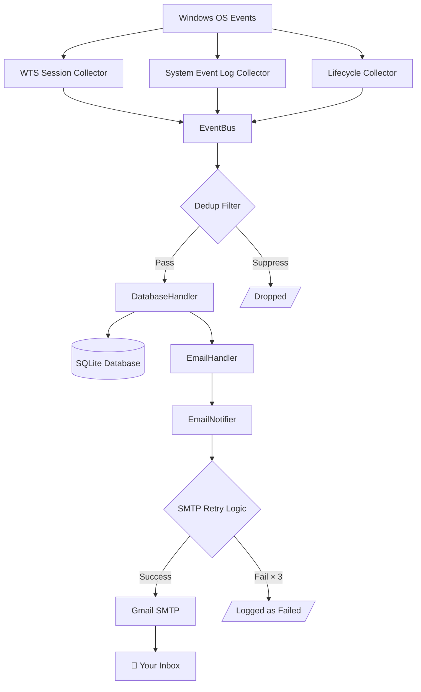

# CyberWatch — Personal Windows Security Monitor

> **Detect. Record. Notify.**  
> A lightweight Python agent that silently monitors Windows session and system events, stores activity in a local SQLite database, and delivers real-time email alerts to your own inbox.


---

## Table of Contents

1. [Overview](#1-overview)  
2. [Why CyberWatch](#2-why-cyberwatch)  
3. [Features](#3-features)  
4. [Architecture](#4-architecture)  
5. [Security & Privacy](#5-security--privacy)  
6. [Technology Stack](#6-technology-stack)  
7. [Project Structure](#7-project-structure)  
8. [Installation — Developer](#8-installation--developer)  
9. [Configuration](#9-configuration)  
10. [Email Setup (Gmail App Password)](#10-email-setup-gmail-app-password)  
11. [Usage](#11-usage)  
12. [Testing & Validation](#12-testing--validation)  
13. [Windows Task Scheduler](#13-windows-task-scheduler)  
14. [Installer Build](#14-installer-build)  
15. [Distribution](#15-distribution)  
16. [Troubleshooting](#16-troubleshooting)  
17. [Privacy Statement](#17-privacy-statement)  
18. [Limitations](#18-limitations)  
19. [Roadmap](#19-roadmap)  
20. [Contributing](#20-contributing)  
21. [License](#21-license)  

---

## 1. Overview

CyberWatch is a **personal, privacy-first Windows security monitor** that runs silently in the background via Windows Task Scheduler. When a security-relevant event occurs — a screen lock, an unlock, a shutdown, or an unexpected restart — CyberWatch:

1. Captures the event with full metadata (timestamp, username, computer name, Windows Event ID)
2. Persists it to a local SQLite database
3. Sends you a formatted email notification via SMTP

Everything runs **locally on your device**. No cloud service, no external API, no third-party telemetry.

---

## 2. Why CyberWatch

| Scenario | CyberWatch helps by… |
|---|---|
| You share a PC and want to know when it was unlocked | Sending an instant email on every UNLOCK event |
| You want a record of when your laptop was powered on | Storing AGENT_START events with timestamps in SQLite |
| Your computer shut down unexpectedly | Detecting Event ID 6008 on the next boot and alerting you |
| You want to verify nobody accessed your machine while you were away | Providing a queryable local event log |

CyberWatch is **not** enterprise endpoint detection software. It is a focused personal tool designed for transparency and simplicity.

---

## 3. Features

| Event | Detection Method | Windows API |
|---|---|---|
| 🔓 Windows Login | WTS Session Notification | `WTSRegisterSessionNotification` |
| 🚪 Windows Logoff | WTS Session Notification | `WTSRegisterSessionNotification` |
| 🔒 Screen Lock | WTS Session Notification | `WTS_SESSION_LOCK` |
| 🔓 Screen Unlock | WTS Session Notification | `WTS_SESSION_UNLOCK` |
| ⛔ System Shutdown | Windows Event Log | Event ID 1074 |
| 🔄 System Restart | Windows Event Log | Event ID 1074 |
| ⚠️ Unexpected Shutdown | Windows Event Log | Event ID 6008 (next boot) |
| ✅ Agent Startup | Self-reported | — |
| 🛑 Agent Shutdown | Self-reported | — |
| ❌ Agent Error | Self-reported | — |

**Additional capabilities:**
- **Duplicate-event suppression** — configurable deduplication window prevents email floods
- **SMTP retry handling** — exponential back-off: 5s → 30s → 120s
- **Structured rotating logs** — daily log rotation via Python `logging`
- **Automatic Windows logon startup** — registered via Windows Task Scheduler (not a Windows Service)
- **Local SQLite persistence** — all events stored with email delivery status

---

## 4. Architecture



**Flow description:**

1. **Collectors** subscribe to Windows OS events using pywin32 APIs and Windows Event Log polling
2. Each detected event is published to the **EventBus** (pub/sub dispatcher)
3. The **Dedup Filter** suppresses identical events within a configurable time window
4. **DatabaseHandler** persists the event to SQLite
5. **EmailHandler** delegates to **EmailNotifier**, which attempts SMTP delivery with automatic retry
6. On failure after all retries, the event is flagged as `email_failed` in the database

---

## 5. Security & Privacy

CyberWatch is designed around **event monitoring**, not content surveillance.

### What CyberWatch captures
- Event type (LOCK, UNLOCK, SHUTDOWN, etc.)
- Timestamp (UTC + local)
- Windows username
- Computer name
- Windows Session ID
- Windows Event ID and source (where applicable)

### What CyberWatch does NOT capture
- ❌ Keystrokes or keyboard input
- ❌ Passwords or credentials
- ❌ Clipboard contents
- ❌ Screenshots or screen recordings
- ❌ Browser history or activity
- ❌ Webcam or microphone
- ❌ File access or application usage
- ❌ Network traffic

### SMTP credentials
Your Gmail App Password is stored **only** in the local `.env` file on your machine. It is:
- Never written to logs (verified in code)
- Never transmitted to any server other than Gmail's SMTP
- Never included in the distributed installer binary

> **Important:** Never share your App Password with anyone, including the developer of this software.

---

## 6. Technology Stack

| Layer | Technology |
|---|---|
| Language | Python 3.12 |
| Event detection | pywin32 (`win32api`, `win32con`, `win32evtlog`, `win32gui`) |
| Database | SQLite 3 (WAL mode, via Python stdlib `sqlite3`) |
| Email | Python stdlib `smtplib`, `email.mime` |
| Configuration | python-dotenv (`.env` file) |
| Logging | Python stdlib `logging` (RotatingFileHandler) |
| Task Scheduler | `subprocess` + `schtasks.exe` |
| Packaging | PyInstaller (single-folder bundle) |
| Installer | Inno Setup 6 |
| Testing | pytest, pytest-cov |

---

## 7. Project Structure

```
CyberWatch/
├── cyberwatch/                     # Core Python package
│   ├── __init__.py
│   ├── agent.py                    # Main entry point (Windows message loop)
│   ├── cli.py                      # CLI commands (configure, test-email, status…)
│   ├── config.py                   # Settings loader (.env / environment)
│   ├── config_wizard.py            # Interactive configuration wizard
│   ├── logging_config.py           # Rotating log setup
│   ├── models.py                   # EventRecord, EventType, EmailStatus
│   ├── collectors/
│   │   ├── wts_session.py          # Lock / Unlock / Login / Logoff (WTS API)
│   │   ├── system_events.py        # Shutdown / Restart (Event Log polling)
│   │   └── lifecycle.py            # Agent self-events (start / stop / error)
│   ├── core/
│   │   ├── event_bus.py            # Pub/sub event dispatcher
│   │   └── dedup_filter.py         # Duplicate event suppression
│   ├── handlers/
│   │   ├── database_handler.py     # Persists events to SQLite
│   │   └── email_handler.py        # Subscribes to EventBus, triggers email
│   ├── storage/
│   │   └── db_manager.py           # SQLite CRUD (WAL mode, thread-safe)
│   ├── notifications/
│   │   ├── email_notifier.py       # SMTP/TLS client with retry logic
│   │   └── templates.py            # Plain-text + HTML email templates
│   └── utils/
│       └── windows_utils.py        # Windows API helper wrappers
│
├── scripts/
│   ├── install_service.py          # Task Scheduler registration
│   └── uninstall_service.py        # Task Scheduler removal
│
├── tests/                          # pytest test suite
│   └── test_windows_utils.py
│
├── packaging/
│   └── build_installer.py          # PyInstaller + Inno Setup build script
│
├── installer/
│   └── cyberwatch.iss              # Inno Setup script
│
├── distribution/                   # Built installer output (gitignored except EXE)
│   ├── CyberWatch-Setup.exe
│   └── FRIEND_SETUP_GUIDE.md
│
├── deploy/
│   └── website/                    # Official product website (GitHub Pages)
│       ├── index.html
│       ├── css/style.css
│       ├── js/main.js
│       ├── docs/                   # HTML documentation
│       └── downloads/              # Bundled installer for web distribution
│
├── docs/                           # Developer documentation
├── data/                           # SQLite DB (gitignored)
├── logs/                           # Log files (gitignored)
├── .env                            # Secrets — NEVER commit (gitignored)
├── .env.example                    # Configuration template
├── pyproject.toml
└── requirements.txt
```

---

## 8. Installation — Developer

### Prerequisites

- Windows 10 or Windows 11
- Python 3.12 or later
- Git

### Steps

```powershell
# 1. Clone the repository
git clone https://github.com/yourusername/cyberwatch.git
cd cyberwatch

# 2. Create virtual environment
python -m venv .venv
.venv\Scripts\Activate.ps1

# 3. Install dependencies
pip install -r requirements.txt

# 4. Post-install pywin32 (required for Windows API access)
python -m pywin32_postinstall -install
```

---

## 9. Configuration

```powershell
# Copy the example config
Copy-Item .env.example .env

# Edit with your credentials
notepad .env
```

### Configuration reference

| Key | Default | Required | Description |
|---|---|---|---|
| `SMTP_HOST` | — | ✅ | SMTP server (e.g. `smtp.gmail.com`) |
| `SMTP_PORT` | `587` | — | Port: 587 = STARTTLS, 465 = SSL |
| `SMTP_USE_TLS` | `true` | — | Use STARTTLS negotiation |
| `SMTP_USER` | — | ✅ | Gmail address used as sender |
| `SMTP_PASSWORD` | — | ✅ | Gmail App Password (16 characters) |
| `NOTIFY_EMAIL` | — | ✅ | Recipient email address for alerts |
| `CHECK_INTERVAL_SECONDS` | `10` | — | Event log poll frequency |
| `DEDUP_WINDOW_SECONDS` | `60` | — | Suppress duplicate events within this window |
| `EMAIL_COOLDOWN_SECONDS` | `30` | — | Minimum gap between emails of the same type |
| `EMAIL_RETRY_MAX` | `3` | — | SMTP retry attempts per event |
| `DB_PATH` | `data/cyberwatch.db` | — | SQLite database file path |
| `LOG_PATH` | `logs/cyberwatch.log` | — | Log file path |
| `LOG_LEVEL` | `INFO` | — | Logging verbosity (`DEBUG`, `INFO`, `WARNING`) |

---

## 10. Email Setup (Gmail App Password)

CyberWatch uses Gmail's SMTP with App Passwords. **Do not use your main Google password.**

### Steps to create a Gmail App Password

1. Go to [myaccount.google.com](https://myaccount.google.com)
2. Navigate to **Security** → **2-Step Verification** (must be enabled)
3. Scroll down to **App passwords**
4. Click **Create** → name it `CyberWatch`
5. Copy the **16-character password**
6. Paste it into `.env` as `SMTP_PASSWORD`

> Your App Password is yours alone. Never share it with anyone.

### Test your configuration

```powershell
python -m cyberwatch.cli test-email
```

You should receive a test alert in your inbox within seconds.

---

## 11. Usage

```powershell
# Run the agent manually (foreground)
python -m cyberwatch.agent

# Run silently (no console window)
pythonw -m cyberwatch.agent

# Install auto-start at logon (Task Scheduler)
python scripts\install_service.py

# Uninstall auto-start
python scripts\uninstall_service.py

# CLI commands (installed EXE)
cyberwatch_cli.exe configure         # Run configuration wizard
cyberwatch_cli.exe test-email        # Send test notification
cyberwatch_cli.exe status            # Show current Task Scheduler status
cyberwatch_cli.exe install-task      # Register Task Scheduler task
cyberwatch_cli.exe uninstall-task    # Remove Task Scheduler task
```

### Task Scheduler management

```powershell
# Check task status
schtasks /Query /TN CyberWatch_Agent /FO LIST

# Start the task immediately
schtasks /Run /TN CyberWatch_Agent

# Stop the task
schtasks /End /TN CyberWatch_Agent
```

---

## 12. Testing & Validation

### Automated tests

```powershell
# Install test dependencies
pip install pytest pytest-cov

# Run all tests
pytest

# Run with coverage report
pytest --cov=cyberwatch --cov-report=term-missing
```

All unit tests run without Windows-specific dependencies (pywin32 is mocked where needed).

### Manual validation results

CyberWatch was manually validated against a real Windows 10/11 machine.

| # | Test Category | Test | Result |
|---|---|---|---|
| 1 | Configuration | `.env` loads correctly | ✅ PASS |
| 2 | SMTP | Gmail SMTP connects and authenticates | ✅ PASS |
| 3 | Agent Startup | `AGENT_START` event fired and emailed | ✅ PASS |
| 4 | LOCK | Screen lock detected (WTS API) | ✅ PASS |
| 5 | UNLOCK | Screen unlock detected (WTS API) | ✅ PASS |
| 6 | Session Switch | WTS_CONSOLE_CONNECT between two sessions | ⚠️ N/A |
| 7 | Duplicate Suppression | Second LOCK within dedup window suppressed | ✅ PASS |
| 8 | Graceful Shutdown | `AGENT_STOP` event fired before exit | ✅ PASS |
| 9 | Restart Recovery | Event ID 1074 detected on next boot | ✅ PASS |
| 10 | Shutdown Recovery | Event ID 6008 detected on next boot | ✅ PASS |
| 11 | SQLite / Logging | Events persisted, logs rotated | ✅ PASS |
| 12 | Task Scheduler | Task registers, runs at logon | ✅ PASS |
| 13 | SMTP Failure/Retry | Retry with back-off on failure | ✅ PASS |

**Note on Session Switch (N/A):** The test machine had only a single Windows user account. The session-switch event (`WTS_CONSOLE_CONNECT` / `WTS_CONSOLE_DISCONNECT` between two active user sessions) cannot be triggered in a single-user environment. All other events were fully validated.

---

## 13. Windows Task Scheduler

CyberWatch uses Windows Task Scheduler with an **At logon** trigger — it does **not** run as a Windows Service. This is intentional:

- A scheduled task runs in your **interactive user session**, which is required to receive WTS (screen lock/unlock) notifications
- A Windows Service running as SYSTEM does not receive these notifications
- No Administrator rights are needed

The task is named `CyberWatch_Agent` and is created under your user account.

---

## 14. Installer Build

The installer is built using PyInstaller (Python → Windows binary) + Inno Setup (binary → `.exe` installer).

### Requirements

- Inno Setup 6 installed (adds `ISCC.exe` to PATH)
- PyInstaller: `pip install pyinstaller`

### Build command

```powershell
python packaging\build_installer.py
```

Output: `distribution\CyberWatch-Setup.exe`

The build script:
1. Runs PyInstaller to create a self-contained Windows binary in `dist\CyberWatch\`
2. Runs Inno Setup (`ISCC.exe`) to package into a single `.exe` installer
3. Copies the result to `distribution\CyberWatch-Setup.exe`

---

## 15. Distribution

The `distribution/` folder contains files ready to share with end users:

```
distribution/
├── CyberWatch-Setup.exe      # One-click Windows installer (~9.5 MB)
└── FRIEND_SETUP_GUIDE.md     # Step-by-step guide for non-technical users
```

The installer:
- Does **not** require Python to be installed
- Does **not** require Administrator rights
- Installs to `%LOCALAPPDATA%\Programs\CyberWatch`
- Prompts the user for their own notification email and Gmail App Password during setup
- Registers the `CyberWatch_Agent` Task Scheduler task automatically
- Provides Start Menu shortcuts to Configure, Test Email, Check Status, and View Logs

**Important:** The installer does not ship any credentials. Every user enters their own.

---

## 16. Troubleshooting

### No emails received

1. Check `logs\cyberwatch.log` for SMTP errors
2. Verify your Gmail App Password is correct (16 characters, spaces optional)
3. Confirm **2-Step Verification** is enabled on your Google account
4. Test SMTP directly:
   ```powershell
   python -c "import smtplib; s=smtplib.SMTP('smtp.gmail.com',587); s.starttls(); s.login('you@gmail.com','your-app-password'); print('SMTP OK')"
   ```
5. Check if your email provider blocks SMTP (corporate email restrictions)

### Lock/Unlock not detected

1. CyberWatch must run in your **interactive session** — check Task Scheduler trigger is "At logon" (not "At startup")
2. Ensure the task runs **as your user**, not as SYSTEM
3. Check antivirus is not blocking WTS notification APIs

### pywin32 import error

```powershell
pip install pywin32
python -m pywin32_postinstall -install
```

Restart your terminal after running the post-install step.

### Shutdown event not logged

- **Event ID 1074** appears only for graceful shutdowns (Start Menu → Shutdown/Restart)
- **Event ID 6008** appears on the *next boot* after an unexpected shutdown (hard power-off, crash)
- Both are checked on agent startup (`lifecycle.py` reads the Event Log at startup)

### Database is locked

SQLite is opened in WAL mode for concurrent access. If you see `database is locked` errors, ensure there is only one instance of `cyberwatch_agent.exe` running.

---

## 17. Privacy Statement

CyberWatch monitors **session-level system events** only. It does not and cannot access:

- Your keystrokes or typed text
- Your passwords or credentials (beyond your own SMTP config)
- Your clipboard
- Your screen contents or screenshots
- Your browser history or activity
- Your camera or microphone
- Your files, documents, or application data
- Your network traffic

All captured data stays on your machine. CyberWatch transmits **only** alert emails to your own inbox via Gmail SMTP. It does not connect to any other server.

Your SMTP credentials (Gmail App Password) are stored only in the local `.env` file and are never written to logs, never sent to any CyberWatch server (none exists), and never included in the installer binary.

---

## 18. Limitations

- **Windows only** — WTS session notifications and Windows Event Log are Windows-exclusive APIs
- **Interactive session required** — must run as a user-level scheduled task, not a system service
- **Single-session design** — designed for personal use on a personal device; not designed for multi-user or terminal server environments
- **Gmail SMTP tested** — other SMTP providers should work but have not been formally tested
- **No remote dashboard** — all data is local; there is no web interface or cloud backend
- **English-language only** — no i18n support currently

---

## 19. Roadmap

These are ideas for future development. None are committed or guaranteed.

- [ ] Configurable per-event-type email enable/disable
- [ ] System tray icon with status indicator
- [ ] SQLite event browser (read-only local viewer)
- [ ] SMTP provider presets (Outlook, ProtonMail)
- [ ] PowerShell configuration alternative to the wizard
- [ ] Automated unit test coverage for collectors
- [ ] Signed installer for Windows SmartScreen compatibility

---

## 20. Contributing

CyberWatch is a personal open-source project. Contributions are welcome.

**Before submitting a pull request:**

1. Run `pytest` — all tests must pass
2. Follow the existing code style (no external linter config required, but match conventions)
3. Do not add external dependencies without justification
4. Do not modify the installer or packaging scripts without testing the full build

**To report a bug:** Open a GitHub issue with your Windows version, Python version, and relevant log output (redact any personal data).

**Security issues:** If you find a security vulnerability, please contact via GitHub private security advisory rather than a public issue.

---

## 21. License

MIT License

Copyright (c) 2026 CyberWatch Contributors

Permission is hereby granted, free of charge, to any person obtaining a copy of this software and associated documentation files (the "Software"), to deal in the Software without restriction, including without limitation the rights to use, copy, modify, merge, publish, distribute, sublicense, and/or sell copies of the Software, and to permit persons to whom the Software is furnished to do so, subject to the following conditions:

The above copyright notice and this permission notice shall be included in all copies or substantial portions of the Software.

THE SOFTWARE IS PROVIDED "AS IS", WITHOUT WARRANTY OF ANY KIND, EXPRESS OR IMPLIED, INCLUDING BUT NOT LIMITED TO THE WARRANTIES OF MERCHANTABILITY, FITNESS FOR A PARTICULAR PURPOSE AND NONINFRINGEMENT. IN NO EVENT SHALL THE AUTHORS OR COPYRIGHT HOLDERS BE LIABLE FOR ANY CLAIM, DAMAGES OR OTHER LIABILITY, WHETHER IN AN ACTION OF CONTRACT, TORT OR OTHERWISE, ARISING FROM, OUT OF OR IN CONNECTION WITH THE SOFTWARE OR THE USE OR OTHER DEALINGS IN THE SOFTWARE.

---

*CyberWatch is a personal project. Use it on your own devices for your own monitoring needs.*
